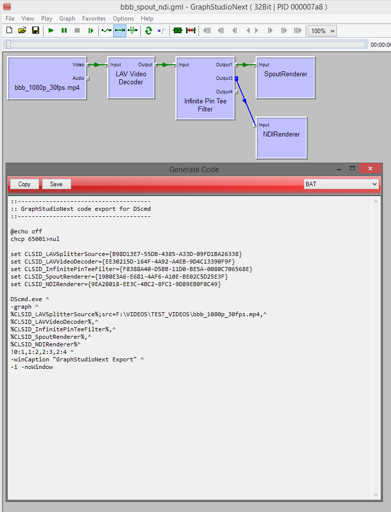

# GraphStudioNext-Enhanced

[GraphStudioNext](https://github.com/cplussharp/graph-studio-next) is a DirectShow graph editor. It's an open source alternative to [Microsoft Graph Edit](https://msdn.microsoft.com/en-us/library/windows/desktop/dd407274.aspx) in the [Windows SDK](https://developer.microsoft.com/en-us/windows/downloads/windows-10-sdk) with many additional features.

[GraphStudioNext-Enhanced](https://github.com/59de44955ebd/graph-studio-next-enhanced) is a fork of GraphStudioNext that adds the following enhancements:

**1. Code Generation**

   The currently loaded graph can be exported as code. At the moment the following languages are available:
   * BAT (using console tool DScmd)
   * C++
   * C# (using DirectShowLib)
   * Lua (using LuaJIT and extension "directshow")

**2. XML with relative pathes**

   GraphStudioNext-Enhanced supports import/export of XML files which use relative pathes to source and destination media files. To not break compatibility with GraphStudioNext and its XML/GRFX format, for such files a new file type caled GML is used.

**3. Accurate progress info when transcoding**

   When transcoding to AVI, the AVI Muxer's IMediaSeek interface is used for the seek bar/progress info, so also when transcoding the seek bar's state is accurate.

**Screenshots**

* A filter graph exported as Windows batch script (BAT):

  

* A filter graph exported as C# code:

  

* A filter graph exported as C++ code:

  

* A filter graph exported as Lua (LuaJIT) code:

  
